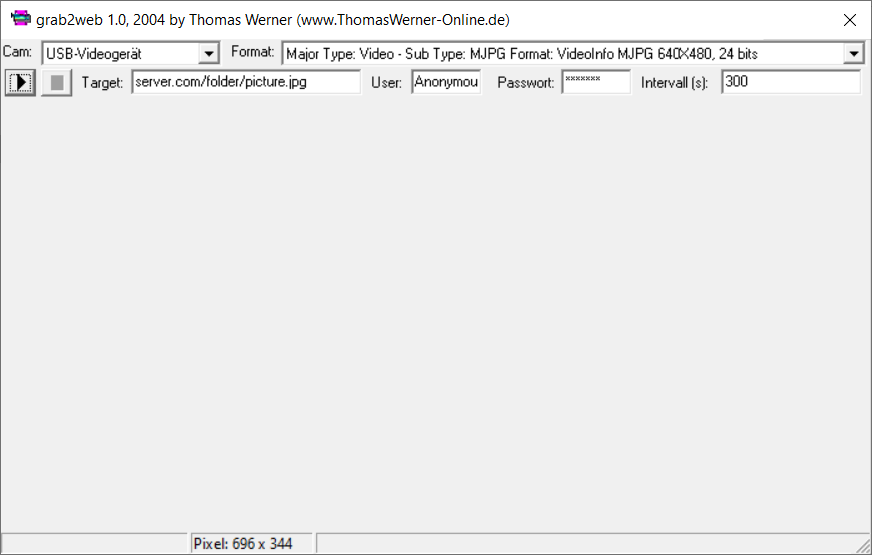

# Grab2Web

This was one of my hobby projects back on 2004. At that time I had to deal with Borland Delphi 6.0 and Microsoft Direct X for video capturing as part of my first job. The result of my private learning efforts is this little program. It can grab images from a video source and upload them to a FTP server. grab2web runs in the background and can be reconfigured via a small icon in the system tray.

Fun fact: Once I let the program run for several days to see if errors occurred in continuous operation. I unexpectedly took pictures of my landlord, who broke into my apartment. 

		
## Requirements

To use grab2web your computer has to fulfill the following requirements:
* DirectX 9b has to be installed
* A video source with WDM driver has to be connected to your computer (e.g. a webcam or a Frame Grabber-Card)
* You need to have a ftp account on your webserver to upload the images
* A graphic card with overlay

## Automization

grab2web can be run in the background. Therefore all necessary data has to be inserted once into the gui. This data including the ftp password will be stored unencrypted into the windows registry. Once the program has stored this data you can open the program using these parameters:
		
* `-h`: grab2web will be started minimized
* `-r`: Image grabbing will be started automatically
* `-c <Folder>`: a copy of each picture will be stored in the given folder
		
## Tips

grab2web uses the jpeg image format to store images. During the capture procedure images are stored as windows bitmaps internally. Due to the fact that the windows bitmap format can not hold more than 24 bit of color data you should select a video format with no more than 24 bit of color data. Otherwise your images may be completely white or black.